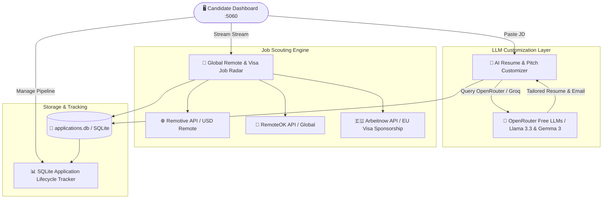

<div align="center">

# 🌐 GlobalCareer AI Engine: Worldwide Remote & Visa Job AutoOps

### *Autonomous Career Intelligence, JD-Based ATS Resume Optimizer, and Foreign Currency (USD/EUR/GBP) Job Scout Platform*

[](https://python.org)
[](https://fastapi.tiangolo.com/)
[](https://openrouter.ai)
[](LICENSE)

</div>

---

## 📌 Project Overview

**GlobalCareer-AI-Engine** is an enterprise-grade autonomous job application and career intelligence platform designed specifically for Senior AI Engineers, Data Engineers, and Qlik/Databricks Architects seeking **Worldwide Remote (USD / EUR / GBP / AUD / CAD)** or **International Relocation / Visa Sponsorship** opportunities while based in India.

The platform unites **JD-based ATS Resume Customization**, **Cold Recruiter Email Pitch Generation**, **Live Multi-Portal Job Scouting**, and an **Application Lifecycle Tracker** in a single glassmorphic desktop web application.

---

## ⚡ System Architecture



---

## 🔑 Key Capabilities

1. 🎯 **JD-Based ATS Resume Customizer**:
   - Paste any Job Description to generate ATS-optimized resume bullet points, extracted target keywords, and match score (0-100%).
   - Supports country-specific formatting standards: **US (ATS Focus)**, **UK (CV & Skills Matrix)**, **EU / Germany (Visa Relocation & Europass)**, and **Global Remote (USD)**.
2. ✉️ **Recruiter Pitch & Cover Letter Generator**:
   - Generates personalized recruiter cold emails targeting foreign currency compensation ($60K–$120K+ USD).
3. 📡 **Live Global Job Radar**:
   - Real-time job stream fetching RemoteOK, Remotive, and Arbeitnow EU Visa jobs.
   - Automatically filters out low-pay INR-only local roles.
4. 📊 **Application Lifecycle Kanban & Tracker**:
   - SQLite-backed pipeline tracking status from `Discovered` → `Tailored` → `Applied` → `Interviewing` → `Offered`.
5. 💼 **LinkedIn Profile Optimizer**:
   - Pre-formatted copy-paste headline, executive summary, and experience bullet points for [linkedin.com/in/pradeep-thallapelly-890b17312](https://linkedin.com/in/pradeep-thallapelly-890b17312).

---

## 🛠️ Quickstart Guide

### 1. Clone & Setup Environment

```bash
git clone https://github.com/pradeepthallapelly369/GlobalCareer-AI-Engine.git
cd GlobalCareer-AI-Engine

pip install -r requirements.txt
```

### 2. Launch Dashboard

```bash
chmod +x launch_career_engine.sh
./launch_career_engine.sh
```

- **Dashboard UI**: `http://localhost:5060`

---

## 👤 Author & Maintainer

**Pradeep Thallapelly**  
*Senior AI & Data Engineer / Analytics Engineering Lead*  
- 💼 **LinkedIn**: [linkedin.com/in/pradeep-thallapelly-890b17312](https://linkedin.com/in/pradeep-thallapelly-890b17312)  
- 📧 **Email**: [pradeep.thallapelly369@outlook.com](mailto:pradeep.thallapelly369@outlook.com)  
- 🐙 **GitHub**: [@pradeepthallapelly369](https://github.com/pradeepthallapelly369)
